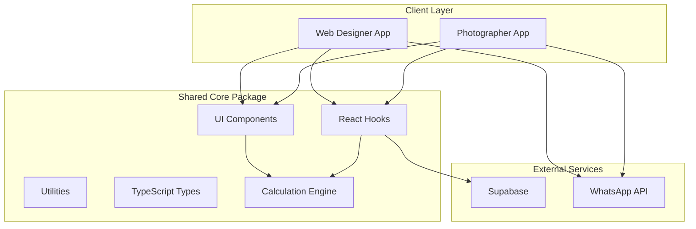

# Design Document: QuickQuote

## Overview

QuickQuote is a Next.js 14+ web application that enables service businesses to create and share professional price quotes via WhatsApp. The system follows a monorepo architecture with a shared core package and two themed application variants (Web Designer and Photographer) to demonstrate the Skeleton Crew template pattern.

The application uses Supabase for authentication and database, Tailwind CSS for styling with a Halloween theme, and React-PDF for PDF generation.

## Architecture



### Monorepo Structure

```
quickquote/
├── apps/
│   ├── web-designer/          # Next.js app for web designers
│   │   ├── app/               # App router pages
│   │   ├── config/            # Theme & seed data
│   │   └── public/            # Static assets
│   └── photographer/          # Next.js app for photographers
│       ├── app/
│       ├── config/
│       └── public/
├── packages/
│   └── core/
│       ├── components/        # Shared UI components
│       ├── hooks/             # React hooks for data fetching
│       ├── lib/               # Utilities and helpers
│       ├── types/             # TypeScript interfaces
│       └── calculation/       # Quote calculation engine
└── package.json               # Workspace root
```

## Components and Interfaces

### Core Components

```typescript
// packages/core/components/index.ts

// Layout Components
export { Header } from './layout/Header';
export { Sidebar } from './layout/Sidebar';
export { DashboardLayout } from './layout/DashboardLayout';

// Form Components
export { Button } from './ui/Button';
export { Input } from './ui/Input';
export { Select } from './ui/Select';
export { Checkbox } from './ui/Checkbox';
export { TextArea } from './ui/TextArea';
export { FileUpload } from './ui/FileUpload';

// Display Components
export { Card } from './ui/Card';
export { Modal } from './ui/Modal';
export { Toast } from './ui/Toast';
export { LoadingSpinner } from './ui/LoadingSpinner';
export { Badge } from './ui/Badge';

// Quote Components
export { QuotePreview } from './quote/QuotePreview';
export { QuotePDF } from './quote/QuotePDF';
export { ServiceSelector } from './quote/ServiceSelector';
export { CustomerSelector } from './quote/CustomerSelector';
export { DiscountInput } from './quote/DiscountInput';
export { QuoteItemRow } from './quote/QuoteItemRow';

// Dashboard Components
export { StatsCard } from './dashboard/StatsCard';
export { RecentQuotes } from './dashboard/RecentQuotes';
export { QuickActions } from './dashboard/QuickActions';
```

### React Hooks

```typescript
// packages/core/hooks/index.ts

// Authentication
export { useAuth } from './useAuth';
export { useSession } from './useSession';

// Data Fetching
export { useBusiness } from './useBusiness';
export { useServices } from './useServices';
export { useCustomers } from './useCustomers';
export { useQuotes } from './useQuotes';
export { useQuote } from './useQuote';

// Mutations
export { useCreateQuote } from './useCreateQuote';
export { useUpdateQuote } from './useUpdateQuote';
export { useCreateCustomer } from './useCreateCustomer';
export { useCreateService } from './useCreateService';

// Dashboard
export { useDashboardStats } from './useDashboardStats';
```

### Calculation Engine Interface

```typescript
// packages/core/calculation/types.ts

export interface QuoteItem {
  serviceId: string;
  serviceName: string;
  quantity: number;
  unitPrice: number;
}

export interface DiscountConfig {
  type: 'percentage' | 'fixed';
  value: number;
}

export interface QuoteCalculation {
  items: QuoteItem[];
  discount?: DiscountConfig;
}

export interface QuoteResult {
  lineItems: Array<QuoteItem & { lineTotal: number }>;
  subtotal: number;
  discountAmount: number;
  total: number;
}

// packages/core/calculation/engine.ts
export function calculateLineTotal(quantity: number, unitPrice: number): number;
export function calculateSubtotal(items: QuoteItem[]): number;
export function calculateDiscount(subtotal: number, discount: DiscountConfig): number;
export function calculateTotal(subtotal: number, discountAmount: number): number;
export function calculateQuote(input: QuoteCalculation): QuoteResult;
```

### Theme Configuration Interface

```typescript
// packages/core/types/theme.ts

export interface AppTheme {
  name: string;
  colors: {
    primary: string;
    secondary: string;
    accent: string;
    background: string;
    surface: string;
    text: string;
    textMuted: string;
  };
  fonts: {
    heading: string;
    body: string;
  };
  halloween: {
    enabled: boolean;
    accentGlow: string;
  };
}

export interface AppConfig {
  appName: string;
  tagline: string;
  theme: AppTheme;
  seedServices: SeedService[];
}
```

## Data Models

### Database Schema (Supabase)

```sql
-- Users table (managed by Supabase Auth)
-- Uses auth.users automatically

-- Businesses table
CREATE TABLE businesses (
  id UUID PRIMARY KEY DEFAULT gen_random_uuid(),
  user_id UUID REFERENCES auth.users(id) ON DELETE CASCADE NOT NULL,
  name VARCHAR(255) NOT NULL,
  logo_url TEXT,
  phone VARCHAR(50),
  email VARCHAR(255),
  address TEXT,
  default_terms TEXT,
  default_validity_days INTEGER DEFAULT 7,
  created_at TIMESTAMPTZ DEFAULT NOW(),
  updated_at TIMESTAMPTZ DEFAULT NOW(),
  UNIQUE(user_id)
);

-- Services table
CREATE TABLE services (
  id UUID PRIMARY KEY DEFAULT gen_random_uuid(),
  business_id UUID REFERENCES businesses(id) ON DELETE CASCADE NOT NULL,
  name VARCHAR(255) NOT NULL,
  description TEXT,
  price DECIMAL(12, 2) NOT NULL CHECK (price >= 0),
  category VARCHAR(100),
  is_active BOOLEAN DEFAULT true,
  created_at TIMESTAMPTZ DEFAULT NOW(),
  updated_at TIMESTAMPTZ DEFAULT NOW()
);

-- Customers table
CREATE TABLE customers (
  id UUID PRIMARY KEY DEFAULT gen_random_uuid(),
  business_id UUID REFERENCES businesses(id) ON DELETE CASCADE NOT NULL,
  name VARCHAR(255) NOT NULL,
  phone VARCHAR(50) NOT NULL,
  email VARCHAR(255),
  address TEXT,
  created_at TIMESTAMPTZ DEFAULT NOW(),
  updated_at TIMESTAMPTZ DEFAULT NOW()
);

-- Quotes table
CREATE TABLE quotes (
  id UUID PRIMARY KEY DEFAULT gen_random_uuid(),
  business_id UUID REFERENCES businesses(id) ON DELETE CASCADE NOT NULL,
  customer_id UUID REFERENCES customers(id) ON DELETE SET NULL,
  quote_number VARCHAR(20) NOT NULL UNIQUE,
  status VARCHAR(20) DEFAULT 'pending' CHECK (status IN ('pending', 'accepted', 'rejected', 'expired')),
  subtotal DECIMAL(12, 2) NOT NULL,
  discount_type VARCHAR(20) CHECK (discount_type IN ('percentage', 'fixed')),
  discount_value DECIMAL(12, 2) DEFAULT 0,
  total DECIMAL(12, 2) NOT NULL,
  notes TEXT,
  terms TEXT,
  valid_until DATE,
  created_at TIMESTAMPTZ DEFAULT NOW(),
  updated_at TIMESTAMPTZ DEFAULT NOW()
);

-- Quote Items table
CREATE TABLE quote_items (
  id UUID PRIMARY KEY DEFAULT gen_random_uuid(),
  quote_id UUID REFERENCES quotes(id) ON DELETE CASCADE NOT NULL,
  service_id UUID REFERENCES services(id) ON DELETE SET NULL,
  service_name VARCHAR(255) NOT NULL,
  quantity INTEGER NOT NULL CHECK (quantity > 0),
  unit_price DECIMAL(12, 2) NOT NULL,
  total_price DECIMAL(12, 2) NOT NULL,
  created_at TIMESTAMPTZ DEFAULT NOW()
);

-- Indexes for performance
CREATE INDEX idx_businesses_user_id ON businesses(user_id);
CREATE INDEX idx_services_business_id ON services(business_id);
CREATE INDEX idx_customers_business_id ON customers(business_id);
CREATE INDEX idx_quotes_business_id ON quotes(business_id);
CREATE INDEX idx_quotes_customer_id ON quotes(customer_id);
CREATE INDEX idx_quotes_status ON quotes(status);
CREATE INDEX idx_quotes_created_at ON quotes(created_at DESC);
CREATE INDEX idx_quote_items_quote_id ON quote_items(quote_id);

-- Row Level Security
ALTER TABLE businesses ENABLE ROW LEVEL SECURITY;
ALTER TABLE services ENABLE ROW LEVEL SECURITY;
ALTER TABLE customers ENABLE ROW LEVEL SECURITY;
ALTER TABLE quotes ENABLE ROW LEVEL SECURITY;
ALTER TABLE quote_items ENABLE ROW LEVEL SECURITY;

-- RLS Policies
CREATE POLICY "Users can only access their own business"
  ON businesses FOR ALL
  USING (auth.uid() = user_id);

CREATE POLICY "Users can only access services from their business"
  ON services FOR ALL
  USING (business_id IN (SELECT id FROM businesses WHERE user_id = auth.uid()));

CREATE POLICY "Users can only access customers from their business"
  ON customers FOR ALL
  USING (business_id IN (SELECT id FROM businesses WHERE user_id = auth.uid()));

CREATE POLICY "Users can only access quotes from their business"
  ON quotes FOR ALL
  USING (business_id IN (SELECT id FROM businesses WHERE user_id = auth.uid()));

CREATE POLICY "Users can only access quote items from their quotes"
  ON quote_items FOR ALL
  USING (quote_id IN (
    SELECT q.id FROM quotes q
    JOIN businesses b ON q.business_id = b.id
    WHERE b.user_id = auth.uid()
  ));

-- Public access for quote viewing (via share link)
CREATE POLICY "Anyone can view quotes by ID"
  ON quotes FOR SELECT
  USING (true);

CREATE POLICY "Anyone can view quote items by quote ID"
  ON quote_items FOR SELECT
  USING (true);
```

### TypeScript Interfaces

```typescript
// packages/core/types/models.ts

export interface Business {
  id: string;
  userId: string;
  name: string;
  logoUrl?: string;
  phone?: string;
  email?: string;
  address?: string;
  defaultTerms?: string;
  defaultValidityDays: number;
  createdAt: Date;
  updatedAt: Date;
}

export interface Service {
  id: string;
  businessId: string;
  name: string;
  description?: string;
  price: number;
  category?: string;
  isActive: boolean;
  createdAt: Date;
  updatedAt: Date;
}

export interface Customer {
  id: string;
  businessId: string;
  name: string;
  phone: string;
  email?: string;
  address?: string;
  createdAt: Date;
  updatedAt: Date;
}

export type QuoteStatus = 'pending' | 'accepted' | 'rejected' | 'expired';

export interface Quote {
  id: string;
  businessId: string;
  customerId?: string;
  quoteNumber: string;
  status: QuoteStatus;
  subtotal: number;
  discountType?: 'percentage' | 'fixed';
  discountValue: number;
  total: number;
  notes?: string;
  terms?: string;
  validUntil?: Date;
  createdAt: Date;
  updatedAt: Date;
  // Relations
  customer?: Customer;
  items?: QuoteItem[];
}

export interface QuoteItem {
  id: string;
  quoteId: string;
  serviceId?: string;
  serviceName: string;
  quantity: number;
  unitPrice: number;
  totalPrice: number;
  createdAt: Date;
}
```

## Correctness Properties

*A property is a characteristic or behavior that should hold true across all valid executions of a system-essentially, a formal statement about what the system should do. Properties serve as the bridge between human-readable specifications and machine-verifiable correctness guarantees.*

Based on the prework analysis, the following correctness properties have been identified:

### Calculation Engine Properties

**Property 1: Line item calculation correctness**
*For any* quote item with quantity q and unit price p, the line total SHALL equal q × p.
**Validates: Requirements 5.3**

**Property 2: Subtotal is sum of line items**
*For any* set of quote items, the subtotal SHALL equal the sum of all line totals.
**Validates: Requirements 6.1**

**Property 3: Percentage discount calculation**
*For any* subtotal s and percentage discount p (0-100), the discount amount SHALL equal s × p / 100.
**Validates: Requirements 5.4, 6.2**

**Property 4: Fixed discount calculation**
*For any* subtotal s and fixed discount f, the final total SHALL equal max(0, s - f).
**Validates: Requirements 5.5, 6.3**

**Property 5: Total never negative**
*For any* quote calculation, the final total SHALL be greater than or equal to zero.
**Validates: Requirements 6.4**

### Data Serialization Properties

**Property 6: Quote data round-trip**
*For any* valid quote object, serializing to JSON then deserializing SHALL produce an equivalent quote object.
**Validates: Requirements 6.5, 6.6**

### Validation Properties

**Property 7: Service price validation**
*For any* service price input, the system SHALL accept only positive numbers.
**Validates: Requirements 3.5**

**Property 8: Required field validation**
*For any* form submission with empty required fields, the system SHALL reject the submission.
**Validates: Requirements 2.2, 13.2**

### Quote Number Properties

**Property 9: Quote number format**
*For any* generated quote, the quote number SHALL match the pattern "QQ-YYYY-NNN" where YYYY is a 4-digit year and NNN is a sequential number.
**Validates: Requirements 5.9**

### Quote Management Properties

**Property 10: Quote list sorting**
*For any* list of quotes returned by the system, they SHALL be sorted by creation date in descending order.
**Validates: Requirements 9.1**

**Property 11: Quote status filtering**
*For any* status filter applied, all returned quotes SHALL have the matching status.
**Validates: Requirements 9.2**

**Property 12: Quote duplication preserves data**
*For any* duplicated quote, the new quote SHALL contain the same customer and services as the original.
**Validates: Requirements 9.4**

### WhatsApp Message Properties

**Property 13: WhatsApp message contains required fields**
*For any* quote, the generated WhatsApp message SHALL contain business name, customer name, quote number, date, validity, total amount, and quote link.
**Validates: Requirements 8.2**

### Dashboard Properties

**Property 14: Dashboard stats accuracy**
*For any* set of quotes in a month, the dashboard SHALL display the correct count and sum of accepted quote values.
**Validates: Requirements 10.1, 10.2, 10.3**

## Error Handling

### Error Types

```typescript
// packages/core/lib/errors.ts

export class QuickQuoteError extends Error {
  constructor(
    message: string,
    public code: string,
    public statusCode: number = 500
  ) {
    super(message);
    this.name = 'QuickQuoteError';
  }
}

export class ValidationError extends QuickQuoteError {
  constructor(message: string, public fields?: Record<string, string>) {
    super(message, 'VALIDATION_ERROR', 400);
    this.name = 'ValidationError';
  }
}

export class AuthenticationError extends QuickQuoteError {
  constructor(message: string = 'Authentication required') {
    super(message, 'AUTH_ERROR', 401);
    this.name = 'AuthenticationError';
  }
}

export class NotFoundError extends QuickQuoteError {
  constructor(resource: string) {
    super(`${resource} not found`, 'NOT_FOUND', 404);
    this.name = 'NotFoundError';
  }
}

export class DatabaseError extends QuickQuoteError {
  constructor(message: string = 'Database operation failed') {
    super(message, 'DB_ERROR', 500);
    this.name = 'DatabaseError';
  }
}
```

### Error Handling Strategy

1. **Client-side validation**: Validate forms before submission using Zod schemas
2. **API error responses**: Return consistent error format with code, message, and optional field errors
3. **Toast notifications**: Display user-friendly error messages via toast component
4. **Retry mechanism**: Allow retry for transient database errors
5. **Logging**: Log errors to console in development, to monitoring service in production

### Halloween-themed Error Messages

```typescript
const errorMessages = {
  generic: "Something spooky happened! Please try again. 👻",
  network: "Lost connection to the spirit realm. Check your internet!",
  validation: "The spirits reject this input. Please check your entries.",
  notFound: "This quote has vanished into the mist... 🌫️",
  auth: "You must enter the crypt first! Please log in.",
};
```

## Testing Strategy

### Testing Framework

- **Unit Tests**: Vitest for fast unit testing
- **Property-Based Tests**: fast-check library for property-based testing
- **Component Tests**: React Testing Library for component testing
- **E2E Tests**: Playwright for end-to-end testing (optional)

### Test Structure

```
packages/core/
├── calculation/
│   ├── engine.ts
│   └── engine.test.ts        # Unit + Property tests
├── lib/
│   ├── validation.ts
│   └── validation.test.ts    # Property tests for validation
├── lib/
│   ├── serialization.ts
│   └── serialization.test.ts # Round-trip property tests
└── components/
    └── __tests__/            # Component tests
```

### Property-Based Testing Approach

Each correctness property will be implemented as a property-based test using fast-check:

```typescript
// Example: Property 1 - Line item calculation
import { fc } from 'fast-check';
import { calculateLineTotal } from './engine';

describe('Calculation Engine', () => {
  /**
   * Feature: quickquote, Property 1: Line item calculation correctness
   * Validates: Requirements 5.3
   */
  it('line total equals quantity times unit price', () => {
    fc.assert(
      fc.property(
        fc.integer({ min: 1, max: 1000 }),      // quantity
        fc.float({ min: 0.01, max: 100000 }),   // unitPrice
        (quantity, unitPrice) => {
          const result = calculateLineTotal(quantity, unitPrice);
          const expected = quantity * unitPrice;
          return Math.abs(result - expected) < 0.01; // floating point tolerance
        }
      ),
      { numRuns: 100 }
    );
  });
});
```

### Test Coverage Requirements

- Calculation engine: 100% coverage with property tests
- Validation functions: Property tests for all validators
- Serialization: Round-trip property tests
- Components: Unit tests for critical user interactions
- Integration: Manual testing for Supabase operations

### Running Tests

```bash
# Run all tests
pnpm test

# Run tests in watch mode
pnpm test:watch

# Run property tests only
pnpm test --grep "Property"

# Run with coverage
pnpm test:coverage
```
